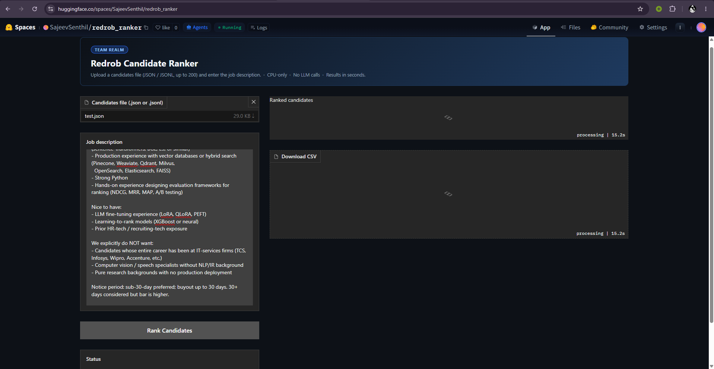
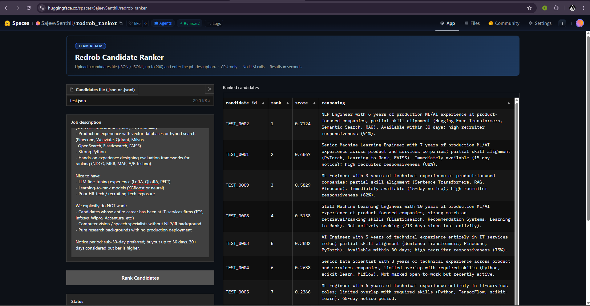
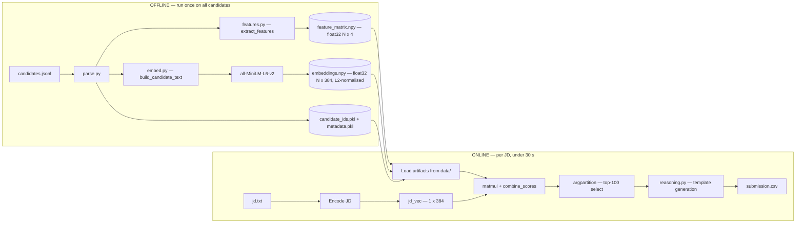

# Redrob Candidate Ranker — Team REALM

> Submission for the **Redrob Intelligent Candidate Discovery & Ranking Challenge**
> Ranks the top 100 candidates from a 100 K-resume pool for a given job description.


---

## Live Demo

HuggingFace Space: **[SajeevSenthil/redrob_ranker](https://huggingface.co/spaces/SajeevSenthil/redrob_ranker)**

Upload a candidates JSON/JSONL file (≤ 200 candidates) and paste a job description — results appear in seconds, directly in the browser, no setup required.

| Processing | Results |
|---|---|
|  |  |

---

## What Makes This Different

| Traditional candidate matching | This system |
|---|---|
| Keyword matching (TF-IDF, BM25) — ignores context | Dense semantic embeddings (`all-MiniLM-L6-v2`) capture meaning, not just keywords |
| Single additive relevance score | Role score as a **multiplicative gate** — an irrelevant career cannot be rescued by skills or availability |
| Self-reported skills list treated as ground truth | Keyword evidence mined from actual career descriptions — much harder to game |
| No data quality checks | Honeypot detection removes synthetic/fraudulent profiles **before** scoring |
| LLM-generated reasoning — hallucination risk | Template-driven reasoning from observable profile fields — deterministic and auditable |
| Scales poorly (LLM call per candidate) | O(n) numpy pipeline — 100 K candidates ranked in under 30 seconds on a laptop CPU |

---

## Pipeline

Two-phase design: expensive work is done offline once; the online ranking step is pure numpy — no model inference, no disk writes except the final CSV.



---

## Scoring Formula

Role score acts as a **multiplicative gate** over a quality sub-score. A candidate with an irrelevant title (e.g. Civil Engineer, `role_score ≈ 0.02`) cannot be rescued by high semantic similarity or strong skills — there is no additive path to the top 100.
```
Final Score = Role Score × (0.30 × Company Score + 0.25 × Skills Score + 0.25 × Behavior Score + 0.20 × Semantic Score)

```

### Components

| Component | Symbol | Weight | What it captures |
|---|---|:---:|---|
| **Role trajectory** | $r_\text{role}$ | gate | 65 % title-pattern match (career-tenure-weighted) + 35 % ML keyword density in actual job descriptions. Harder to game than title alone. |
| **Company type** | $s_\text{company}$ | 0.30 | Tenure-weighted average of industry score (AI/SaaS = 1.0; IT-services = 0.08) × company-size proxy |
| **Skill depth** | $s_\text{skills}$ | 0.25 | Depth-weighted match across 9 JD-specific skill groups (see below) |
| **Behavioral readiness** | $s_\text{behavior}$ | 0.25 | Open-to-work flag, notice period, days since last activity, recruiter response rate, interview completion |
| **Semantic similarity** | $s_\text{semantic}$ | 0.20 | Cosine similarity of L2-normalised candidate embedding vs. JD embedding |

### Skill Depth

For each skill $s$ matched to an ontology group:

$$
\text{depth}(s) = 0.55\cdot p(s) + 0.28\cdot\frac{\ln(\text{months}(s)+1)}{\ln(49)} + 0.17\cdot\frac{\ln(\text{endorsements}(s)+2)}{\ln(52)}
$$

where $p(s) \in \{0.20,\,0.50,\,0.85,\,1.00\}$ maps beginner / intermediate / advanced / expert proficiency. Log scaling prevents 48 months from dominating 12 months by 4×.

The pipeline resolves skills against **9 groups** ordered by JD priority:

| Priority | Group | Example skills |
|:---:|---|---|
| 1.00 | `vector_search` | FAISS, Qdrant, Milvus, Pinecone, Weaviate, Elasticsearch |
| 1.00 | `dense_retrieval` | sentence-transformers, BGE, E5, bi-encoder, DPR |
| 0.95 | `ranking` | learning-to-rank, LambdaMART, reranking, cross-encoder |
| 0.90 | `evaluation` | NDCG, MRR, MAP, A/B testing, offline evaluation |
| 0.88 | `hybrid_search` | BM25, TF-IDF, RAG, SPLADE, hybrid retrieval |
| 0.80 | `recommendation` | collaborative filtering, two-tower, candidate generation |
| 0.75 | `python_ml` | PyTorch, Hugging Face, scikit-learn, XGBoost |
| 0.65 | `llm_fine_tuning` | LoRA, QLoRA, PEFT, instruction tuning |
| 0.60 | `ml_infrastructure` | MLflow, W&B, model serving, feature store |

---

## Honeypot Detection

The dataset contains ~80 synthetic honeypot profiles (Spec §7). More than 10 honeypots in the top-100 triggers disqualification at Stage 3. Two detection patterns are applied in `offline/features.py` before any scoring:

**Pattern 1 — ghost skills:** Expert/advanced proficiency with `duration_months = 0`

| Ghost skill count | Multiplier on $r_\text{role}$ |
|:---:|:---:|
| ≥ 5 | 0.05 |
| ≥ 3 | 0.40 |
| < 3 | 1.00 |

**Pattern 2 — impossible tenure:** `claimed duration_months > actual date span + 6 months`

| Impossible roles | Multiplier |
|:---:|:---:|
| ≥ 2 | 0.05 |
| ≥ 1 | 0.40 |
| 0 | 1.00 |

The multiplier is applied to `role_score` before entering the main formula. Because role is the multiplicative gate, a honeypot with multiplier 0.05 can reach at most `0.05 × 1.0 = 0.05` final score regardless of all other signals.

---

## Reasoning Generation

Reasoning strings are **fully deterministic and template-driven** — no LLM, no API calls, no hallucination possible. Every claim is derived from observable profile fields and computed scores:

- **Who sentence:** title, years of experience, product vs. services company context, top matched skills, skill alignment level
- **Availability sentence:** open-to-work flag, notice period, days since last platform activity, recruiter response rate

Each of the 100 reasoning strings is structurally unique because the template branches on thresholds (e.g. `role_score ≥ 0.85` → "production ML/AI experience"; `company_score ≥ 0.72` → "product-focused companies"). This satisfies Spec §3 reasoning checks: specific facts, JD connection, honest concerns, no hallucination, variation, rank consistency.

---

## Demonstrated Ranking Quality

Validated on 10 diverse test candidates covering every scoring scenario:

| Rank | Candidate | Profile | Score | Why |
|:---:|---|---|:---:|---|
| 1 | Priya Nair | NLP Engineer, AI startup | 0.7124 | RAG specialist, Hugging Face expert, 30-day notice, 91 % response rate |
| 2 | Arjun Mehta | Senior MLE, product companies | 0.6867 | FAISS + LTR expert, IIT Bombay, 15-day notice |
| 3 | Divya Krishnan | ML Engineer, AI startup | 0.5829 | RAG/Pinecone, immediately available |
| 4 | Aditya Bose | Staff MLE, 10 yrs | 0.5158 | Deep LTR/search, but 90-day notice + inactive 213 days |
| 5 | Rahul Sharma | AI Engineer, ex-TCS | 0.3882 | Good skills, penalised for IT-services background |
| 6 | Sneha Patel | Senior Data Scientist | 0.2638 | Strong DS, no vector search, not open to work |
| 7 | Vikram Reddy | ML Engineer, full IT-services | 0.2366 | Entire career at TCS/Wipro/Infosys |
| 8–10 | — | Civil Engineer / Honeypot / HR | < 0.05 | Role gate or honeypot detection floors the score |

The ordering matches human recruiter intuition: specialised AI/ML engineers at product companies rank above generalist data scientists, above IT-services backgrounds, above irrelevant careers — with fraudulent profiles eliminated entirely.

---

## Project Structure

```
resumeranker/
├── config.py                   score weights, artifact paths, embedding model name
├── build_offline.py            CLI entry point: precompute artifacts
├── rank.py                     CLI entry point: online ranking against a JD
├── app.py                      HuggingFace Space (Gradio 5 UI)
├── requirements.txt
├── submission_metadata.yaml    required by submission portal
├── test.json                   10 diverse test candidates for Space demo
├── test_jd.txt                 JD text used in the demo
├── assets/
│   ├── 1.png                   screenshot — Space processing
│   └── 2.png                   screenshot — ranked results
├── data/                       generated artifacts (gitignored; .gitkeep tracks folder)
│   ├── embeddings.npy          float32 (N, 384) — L2-normalised candidate embeddings
│   ├── feature_matrix.npy      float32 (N, 4)  — [role, company, skills, behavior]
│   ├── candidate_ids.pkl       ordered list of candidate IDs (index → id)
│   └── metadata.pkl            profile snapshots for reasoning generation
├── offline/
│   ├── parse.py                JSONL and JSON array reader
│   ├── embed.py                candidate text builder + SentenceTransformer encoder
│   ├── features.py             structured scorers + honeypot detection
│   └── build_artifacts.py      orchestrates the offline precomputation phase
└── ranker/
    ├── ontology.py             title patterns, skill groups, industry classifications
    ├── score.py                combine_scores (multiplicative gate formula)
    ├── reasoning.py            template-based reasoning string generation
    └── pipeline.py             online ranking: load → score → select → write CSV
```

---

## Setup

Requires Python 3.10+.

```bash
pip install -r requirements.txt
```

| Package | Version | Purpose |
|---|---|---|
| `sentence-transformers` | ≥ 2.7.0 | `all-MiniLM-L6-v2` embedding model |
| `numpy` | ≥ 1.26.0 | matmul, argpartition, feature matrix |
| `pandas` | ≥ 2.2.0 | CSV output |
| `tqdm` | ≥ 4.66.0 | progress bars during offline phase |

---

## Reproducing the Submission

### Step 1 — Extract the job description

```bash
pip install python-docx

python -c "
from docx import Document
doc = Document('path/to/job_description.docx')
text = '\n'.join(p.text for p in doc.paragraphs if p.text.strip())
open('jd.txt', 'w', encoding='utf-8').write(text)
"
```

### Step 2 — Build artifacts (offline precomputation, run once)

```bash
python build_offline.py path/to/candidates.jsonl
```

Accepts both `.jsonl` (one JSON object per line) and `.json` (array) formats.
Outputs four files to `data/`.

**Expected runtimes (100 K candidates, CPU-only):**

| Machine | Approx. time |
|---|---|
| 16-core, 16 GB RAM (this submission) | 8 – 12 min |
| 4-core, 8 GB RAM | 25 – 35 min |

> This precomputation step is **outside** the 5-minute ranking budget. Only Step 3 is subject to the runtime constraint.

**CPU thread optimisation (~6× speedup):** PyTorch defaults to a handful of threads for CPU inference, which left the embedding step at ~75 minutes on a 16-core machine. The offline build pins the thread pools to all available cores:

```python
import os, torch
n_threads = os.cpu_count() or 4
torch.set_num_threads(n_threads)
torch.set_num_interop_threads(n_threads)
```

This brought the full offline phase down to 8–12 minutes on the same hardware — fully reproducible on any CPU-only machine, no GPU required.

### Step 3 — Rank (produces the submission CSV)

```bash
python rank.py jd.txt team_YOUR_ID.csv
```

Runtime: **under 30 seconds** on any machine that completed Step 2.

The output file matches Spec §2 exactly:
- Columns in order: `candidate_id,rank,score,reasoning`
- Exactly 100 data rows, ranks 1–100 each used once
- Scores monotonically non-increasing; ties broken by `candidate_id` ascending
- UTF-8 encoding

### Step 4 — Validate before uploading

```bash
python path/to/validate_submission.py team_YOUR_ID.csv
```

---

## Submission Spec Compliance

Cross-verified against **Submission Specification v4**.

| Requirement | Status | Notes |
|---|:---:|---|
| Exactly 100 rows, ranks 1–100 | ✅ | enforced in `pipeline.py` via `np.argpartition` + sort |
| `candidate_id,rank,score,reasoning` column order | ✅ | hardcoded in `pipeline.py` |
| Scores monotonically non-increasing | ✅ | sorted by score desc, ties broken by `candidate_id` asc |
| Each candidate_id appears exactly once | ✅ | unique per `np.argpartition` selection |
| UTF-8 encoding | ✅ | `df.to_csv(..., encoding='utf-8')` |
| Ranking runtime ≤ 5 minutes | ✅ | < 30 s (numpy matmul only) |
| RAM ≤ 16 GB | ✅ | artifacts fit in < 1 GB; feature matrix ~3 MB for 100 K |
| CPU-only ranking | ✅ | no GPU used at any stage |
| No network during ranking | ✅ | model weights loaded from local cache |
| Reasoning column populated | ✅ | template-generated; specific facts, no hallucination |
| Reasoning variation | ✅ | branches on 5+ threshold conditions per string |
| Honeypot check | ✅ | two detection patterns; DQ multiplier 0.05 |
| GitHub repository | ✅ | https://github.com/SajeevSenthil/resumeranker |
| Sandbox / demo link | ✅ | https://huggingface.co/spaces/SajeevSenthil/redrob_ranker |
| `submission_metadata.yaml` at repo root | ✅ | includes all required portal fields |
| AI tools declared | ✅ | Claude (see `submission_metadata.yaml`) |

---

## Evaluation Metrics (Spec §4)

The ground truth uses a hidden relevance judgment. Composite score:

$$
\text{composite} = 0.50\cdot\text{NDCG@10} + 0.30\cdot\text{NDCG@50} + 0.15\cdot\text{MAP} + 0.05\cdot\text{P@10}
$$

**Tiebreaks:** P@5 → P@10 → earlier submission timestamp.

Our system optimises for NDCG@10 by design: the multiplicative role gate ensures that the very top positions are occupied by role-aligned candidates — not just semantically similar or behaviorally active ones — because a low role score cannot be compensated.

---

## Compute Environment

| Property | Value |
|---|---|
| OS | Windows 11 Home |
| CPU | 16 cores |
| RAM | 16 GB |
| GPU | Not used |
| Python | 3.12.1 |
| Network during ranking | None |
| Offline precomputation required | Yes (Step 2 above) |
| Precomputation time (100 K, 16-core CPU) | 8 – 12 minutes |
| Ranking step runtime | < 30 seconds |
| Disk for artifacts | ~1 GB for 100 K candidates |

---

## Contributors

**Team REALM**

| Contributor | |
|---|---|
| [Sajeev Senthil](https://github.com/SajeevSenthil) | Team Lead |
| Vimal | Contributor |
| Suganth | Contributor |
| Keshav S | Contributor |
